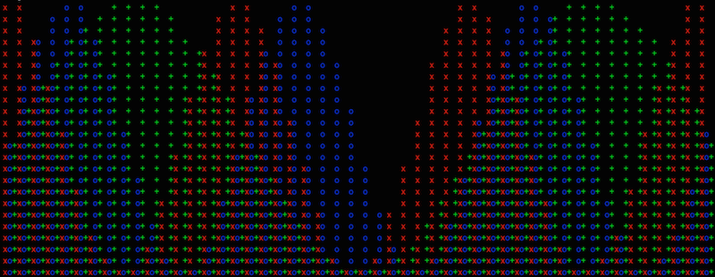
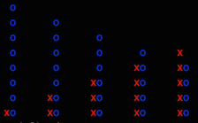

# terminal-bar
Simple bar graphs for the terminal



###Installation
```
npm install terminal-bar
```

###Basic Usage
```
var bar = require('terminal-bar')
  , data = [1, 2, 3, 4, 5];
  
console.log(bar(data, {height: 5}));
```
produces:

```
    x
   xx
  xxx
 xxxx
xxxxx
```

###Multiple Series
```
console.log(bar([[1,2,3,4,5],[8,7,6,5,4]], {height: 8}))

 o
 o o
 o o o
 o o o ox
 o o oxoxo
 o oxoxoxo
 oxoxoxoxo
xoxoxoxoxo
```
###Horizontal Spacing
```
console.log(bar([[1,2,3,4,5],[8,7,6,5,4]], {height: 8, width: 30}))

 o
 o         o
 o         o         o
 o         o         o         o        x
 o         o         o        xo        xo
 o         o        xo        xo        xo
 o        xo        xo        xo        xo
xo        xo        xo        xo        xo
```

###Colored
```
console.log(bar([[1,2,3,4,5],[8,7,6,5,4]], {height: 8, width: 30, color: true}))
```


###Advanced
```
bar(series, options)

  series - an array of numbers
         - an array of equal length array of numbers
         
  options
      .color  - truthy, non-array values will use default colors:
      			['red', 'green', 'blue', 'cyan', 'yellow']
              - An array will use the specified colors for each series.
              - default is to use no colors
             
      .icon   - a string containing icons for each series
              - defaults are 'xo+*^@'
             
      .height - # of rows to draw, default is 24
      
      .width  - approximate # of columns to draw, spaces calculated to separate
                data columns
      
      .title  - string to print above graph
```
